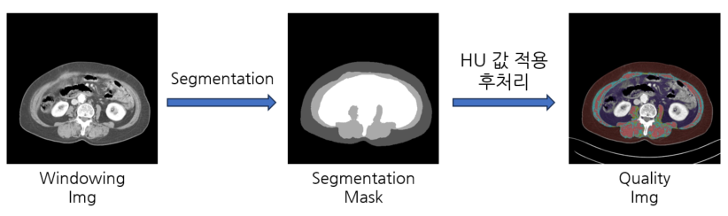
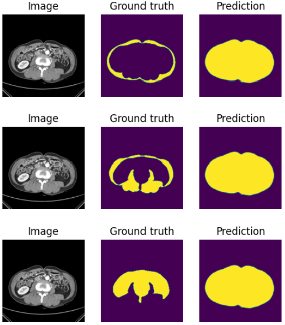

# L3_segmentation

근감소증 환자를 판별하기 위해 L3 부위 피하지방, 근육, 내장지방을 세그멘테이션 하는 프로젝트

---

## INTRO

-   근감소증
    -   sarcopenia는 근육량 감소, 근력 감소, 근지구력 감소를 특징으로 하는 근육 질환
    -   sarcopenia는 노화, 만성질환, 약물 부작용 등으로 인해 발생할 수 있으며, 사망 위험을 증가시킴
-   AI를 적용하는 이유
    -   정확하고 신속한 진단
    -   개별적인 특성 고려
    -   효과적인 치료
-   기대 효과
    -   AI는 sarcopenia의 진단 및 치료에 있어 중요한 역할을 할 것으로 기대
    -   정확하고 효과적으로 진단하고 치료

---

---

## 모델

### 1. [SMP(segmentation_models.pytorch)](https://github.com/qubvel/segmentation_models.pytorch/tree/master)

#### [프로젝트 세부 내용](./models/SMP/README.md)

#### 결과

-   결과분석(아래 3epoch 학습 결과)

    -   1000 epoch 학습한 결과 intensity에 따라 segmentation은 잘 됨.
    -   그러나 [binary segmentation 예제](https://github.com/qubvel/segmentation_models.pytorch/blob/master/examples/binary_segmentation_intro.ipynb)바탕으로 전처리 및 학습을 하였고, 위 예제에는 두 class가 한 사진에 동시 등장하지 않으므로 설계 구조 자체가 다르기에 동시에 여러 클래스를 나타낼 수 없으므로 아래와 같이 loss가 낮아지도록 몸통 전체를 잡아냄.
    -   결과: 실패
    -   보완점: 다중 클래스, 한 이미지 동시 등장하도록 전처리, 설계를 바꿔야함.

    

---

### 2. [nnUNet](https://github.com/MIC-DKFZ/nnUNet)

#### [프로젝트 세부 내용](./models/nnUNet/README.md)

#### 결과

-   결과분석

    -   73epoch에서 가장 낮은 validation loss가 나옴
    -   visceral fat에서 intentsity가 낮은 부분은 제외하고 mask를 그림
    -   준수한 성능

-   predict test set - IoU: 0.9628262044508722 - f1_macro score: 0.9641467903028997 - accuacy: 0.9737020775123879
    

-   predict test set(HU 적용된 테스트 셋 900개) - IoU: 0.8536284178059751 - f1_macro score: 0.919161017746382 - accuacy: 0.9582923056065351
    

---

### 3. [MedSAM](https://github.com/bowang-lab/MedSAM)

(예정)

#### 전처리

---
