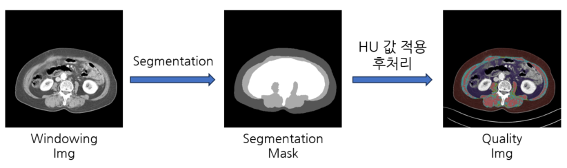

# L3_segmentation

근감소증 환자를 판별하기 위해 L3 부위 피하지방, 근육, 내장지방을 세그멘테이션 하는 프로젝트

---

## INTRO

-   근감소증
    -   sarcopenia는 근육량 감소, 근력 감소, 근지구력 감소를 특징으로 하는 근육 질환
    -   sarcopenia는 노화, 만성질환, 약물 부작용 등으로 인해 발생할 수 있으며, 사망 위험을 증가시키는 것
-   AI를 적용하는 이유
    -   정확하고 신속한 진단
    -   개별적인 특성 고려
    -   효과적인 치료
-   기대 효과
    -   AI는 sarcopenia의 진단 및 치료에 있어 중요한 역할을 할 것으로 기대
    -   정확하고 효과적으로 진단하고 치료

---

---

## 모델

### SMP

#### 전처리

#### 결과

---

### nnUNet

###

#### 전처리

---

### MedSAM

####

---
