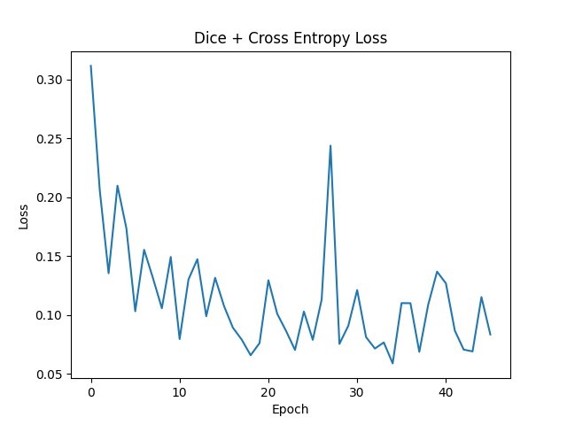
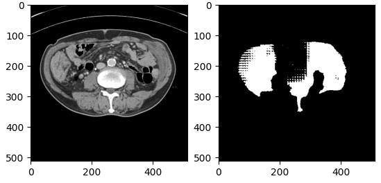
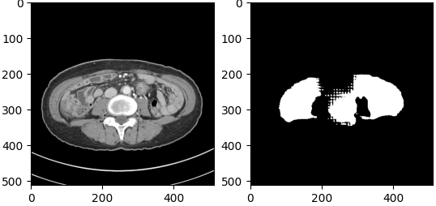
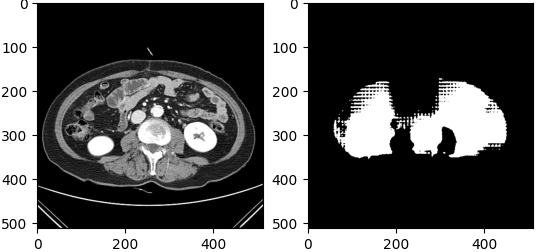
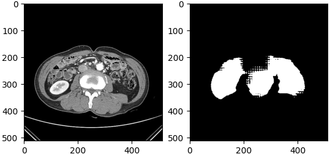

# 모델

## 3. [MedSAM](https://github.com/bowang-lab/MedSAM)

Segment Anything in Medical Images.

### [SAM(Segment Anything Model)](https://github.com/facebookresearch/segment-anything)

-   점이나 상자와 같은 입력 프롬프트에서 고품질 개체 마스크를 생성하며 이미지의 모든 개체에 대한 마스크를 생성하는 데 사용 가능
-   1,100만 개의 이미지와 11억 개의 마스크로 구성된 데이터 세트에 대해 훈련됨
-   다양한 분할 작업에서 강력한 제로샷 성능을 발휘

### 환경 설정

```
conda create -n medsam python=3.10 -y
conda activate medsam
conda install -y pytorch==2.0.1 torchvision==0.15.2 torchaudio==2.0.2 pytorch-cuda=11.8 -c pytorch -c nvidia
git clone https://github.com/bowang-lab/MedSAM
cd MedSAM
pip install -e .
```

매번 실행 시

```python
import os
os.environ['KMP_DUPLICATE_LIB_OK']='True'
```

또는 터미널에서

```bash
set KMP_DUPLICATE_LIB_OK=True
```

### 데이터 전처리

-   [[전처리 코드](data_preprocess.ipynb)]
    `train_one_gpu.py` 의 학습 스크립트를 따름
    `work_dir/SAM/sam_vit_b_01ec64.pth` 를 바탕으로 학습하기에 데이터 입력 형식 맞춤

-   img
    -   shape = (1024 \* 1024 \* 3)
    -   확장자는 npy
-   mask
    -   shape = (1024 \* 1024)
    -   확장자는 npy

### 사용 방법

-   학습 명령어

```bash
python train_one_gpu.py -i [인풋 데이터 path] -checkpoint [저장할 pth path] -pretrain_model_path [사전학습 pth path] -num_epochs [epoch 수]
python train_one_gpu.py -i data/npy/MR_L3 -pretrain_model_path model_weight/medsam_vit_b.pth -num_epochs 100
```

-   inference
    오류 발생 시 [MedSAM home]/segment_anything/build_sam.py 수정 - state_dict = torch.load(f) --> state_dict = torch.load(f)['model']

```bash
python MedSAM_Inference.py -i [data_path.png] -chk [학습된 pth 파일] -o [저장 위치]
python MedSAM_Inference.py -i assets/img_demo.png -chk work_dir/MedSAM/medsam_vit_b.pth
```

### 결과

-   RTX 3080 단일 GPU, 1080개 데이터 학습 기준 1epoch 당 3시간 소요
-   45 epoch 중 34 epoch 결과 아래 표시
-   낮은 성능 및 열화 발생 - 더 많은 학습 필요할 것으로 보임
    
    
    
    
    
