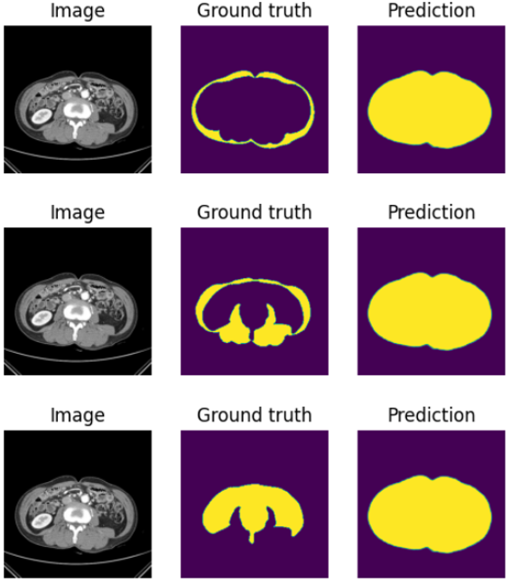

# 모델

## 1. [SMP(segmentation_models.pytorch)](https://github.com/qubvel/segmentation_models.pytorch/tree/master)

-   High level API (just two lines to create a neural network)
-   9 models architectures for binary and multi class segmentation (including legendary Unet)
-   124 available encoders (and 500+ encoders from timm)
-   All encoders have pre-trained weights for faster and better convergence
-   Popular metrics and losses for training routines

### 사용 방법

-   예제
    -   `Pytorch-Lightning`과 함께 사용한 개와 고양이 [binary segmentation 예제](https://github.com/qubvel/segmentation_models.pytorch/blob/master/examples/binary_segmentation_intro.ipynb)
        -   PyTorch Lightning: PyTorch에 대한 High-level 인터페이스를 제공하는 오픈소스
    -   `Catalyst`, `TTAch`, `Albumentations`을 이용한 [단일 segmentation 예제](https://github.com/catalyst-team/catalyst/blob/v21.02rc0/examples/notebooks/segmentation-tutorial.ipynb)
        -   Catalyst: high-level framework for PyTorch
        -   TTAch: TTA library for PyTorch
        -   Albumentations: fast image augmentation library

### 전처리

#### [전처리 상세 과정](../../data/README.md)

-   **train 데이터 2차 전처리** [[ipynb 파일](../../data/preprocess_script/train_preprocess_2.ipynb)]
    -   SMP학습에 직접 사용하는 데이터 셋(1078개) : ./data_train
        -   train: 862개, validation: 108개, test: 108개
    -   image
        -   40 ~ 400 윈도잉 적용
    -   mask: S[파일이름], M[파일이름], V[파일이름]
        -   0: background, 1:Subcutaneous fat
        -   0: background, 1:Muscle
        -   0: background, 1:Visceral fat

### 결과

-   결과분석(아래 3epoch 학습 결과)
    -   1000 epoch 학습한 결과 intensity에 따라 segmentation은 잘 됨.
    -   그러나 [binary segmentation 예제](https://github.com/qubvel/segmentation_models.pytorch/blob/master/examples/binary_segmentation_intro.ipynb)바탕으로 전처리 및 학습을 하였고, 위 예제에는 두 class가 한 사진에 동시 등장하지 않으므로 설계 구조 자체가 다르기에 동시에 여러 클래스를 나타낼 수 없으므로 아래와 같이 loss가 낮아지도록 몸통 전체를 잡아냄.
    -   결과: 실패
    -   보완점: 다중 클래스, 한 이미지 동시 등장하도록 전처리, 설계를 바꿔야함.
-   predict sample 1set
    
-   [predict sample 4set](../../documentation/assets/smp_result2.png)
