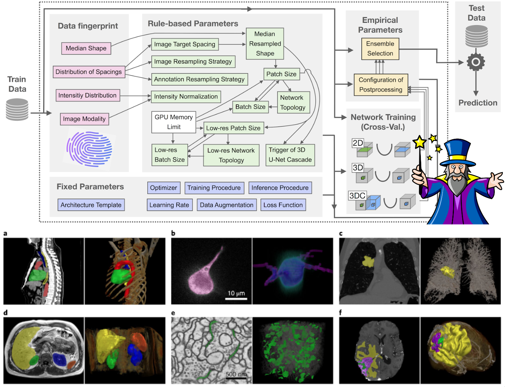
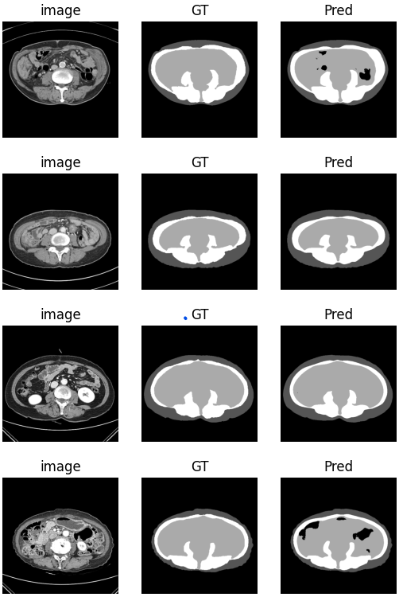
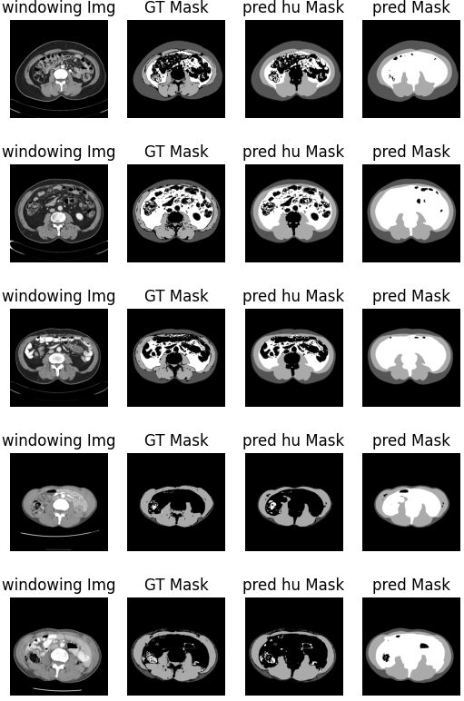

# 모델

## 2. [nnUNet](https://github.com/MIC-DKFZ/nnUNet)



-   별도의 설치나 구성이 필요 없이 바로 사용할 수 있는 알고리즘을 제공
-   개별 파이프라인을 조정할 필요 없이(예: 새로운 손실 함수 평가) 수많은 데이터세트에 대한 기여도를 테스트하는 방법 개발 프레임워크 역할을 할 수 있습니다.
-   추가 데이터세트별 최적화를 위한 강력한 출발점을 제공합니다. 이는 특히 세분화 과제에서 경쟁할 때 사용됩니다.
-   분할 방법 설계에 대한 새로운 관점을 제공합니다. 데이터 세트 속성과 가장 적합한 분할 파이프라인 간의 더 나은 연결을 찾을 수 있을까요?

### 환경 설정

```
pip install nnunetv2
git clone https://github.com/MIC-DKFZ/nnUNet.git
cd nnUNet
pip install -e .
pip install --upgrade git+https://github.com/FabianIsensee/hiddenlayer.git
```

### 사용 방법

-   [정리본 ppt](nnUnet_usage.pptx)
-   [주피터 노트북](Use_nnUNet.ipynb)
-   [공식 홈페이지 사용법](https://github.com/MIC-DKFZ/nnUNet/blob/master/documentation/how_to_use_nnunet.md)

### 결과

-   결과분석

    -   73epoch에서 가장 낮은 validation loss가 나옴
    -   visceral fat에서 intentsity가 낮은 부분은 제외하고 mask를 그림
    -   준수한 성능

-   predict test set

    -   IoU: 0.9628262044508722
    -   f1_macro score: 0.9641467903028997
    -   accuacy: 0.9737020775123879
        

-   predict test set(HU 적용된 테스트 셋 900개)
    -   IoU: 0.8536284178059751
    -   f1_macro score: 0.919161017746382
    -   accuacy: 0.9582923056065351
        
