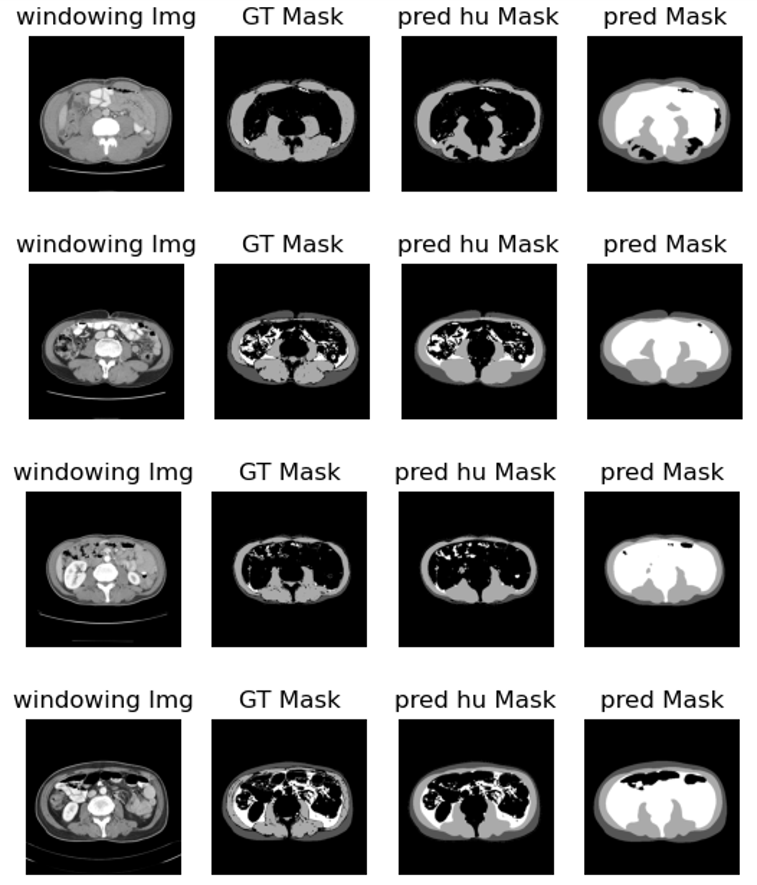

# 모델

## 2. [nnUNet](https://github.com/MIC-DKFZ/nnUNet)


-   별도의 설치나 구성이 필요 없이 바로 사용할 수 있는 알고리즘을 제공
-   개별 파이프라인을 조정할 필요 없이(예: 새로운 손실 함수 평가) 수많은 데이터세트에 대한 기여도를 테스트하는 방법 개발 프레임워크 역할을 할 수 있습니다.
-   추가 데이터세트별 최적화를 위한 강력한 출발점을 제공합니다. 이는 특히 세분화 과제에서 경쟁할 때 사용됩니다.
-   분할 방법 설계에 대한 새로운 관점을 제공합니다. 데이터 세트 속성과 가장 적합한 분할 파이프라인 간의 더 나은 연결을 찾을 수 있을까요?

### 환경 설정

```
pip install nnunetv2
git clone https://github.com/MIC-DKFZ/nnUNet.git
cd nnUNet
pip install -e .
pip install --upgrade git+https://github.com/FabianIsensee/hiddenlayer.git
```

git clone 후 nnUNet에 **현 폴더의 내용만 복사**할 것!

### 사용 방법

-   [정리본 ppt](nnUnet_usage.pptx)
-   [주피터 노트북](Use_nnUNet.ipynb)
-   [공식 홈페이지 사용법](https://github.com/MIC-DKFZ/nnUNet/blob/master/documentation/how_to_use_nnunet.md)

### 결과

-   결과분석

    -   73epoch에서 가장 낮은 validation loss가 나옴
    -   visceral fat에서 intentsity가 낮은 부분은 제외하고 mask를 그림
    -   기존 모델에 비해 준수한 성능

-   predict test set

|                | Sfat       | muscle     | Vfat       |
| -------------- | ---------- | ---------- | ---------- |
| IoU            | 0.95033022 | 0.89425196 | 0.91567544 |
| f1_macro score | 0.98567289 | 0.96375608 | 0.97519908 |
| accuacy        | 0.99475716 | 0.97857931 | 0.99035207 |
| dice_score     | 0.97432034 | 0.94070718 | 0.95585051 |


-   predict test set(HU 적용된 테스트 셋 900개)

|            | Sfat     | muscle   | Vfat     |
| ---------- | -------- | -------- | -------- |
| IoU        | 0.810893 | 0.807782 | 0.729217 |
| F1 score   | 0.938769 | 0.938475 | 0.905202 |
| accuacy    | 0.988644 | 0.978098 | 0.9796   |
| dice_score | 0.883777 | 0.88919  | 0.821543 |


### [기존 모델과의 비교](./compare_with_standard.pdf)

-   [정확도 비교 소스코드](./compare_with_standard.ipynb)
-   [기존 모델](https://github.com/embed-Rayn/commercialization/blob/main/program.md)
    -   dicom 파일 시리즈를 입력 시
        -   "L3 위치 dicom 파일 선정" - "segmentation"
        -   정확한 L3 위치 dicom 파일을 골랐을 경우만 테스트 셋으로 사용
        -   900개의 데이터 중 147개 사용
    -   predict test set(HU 적용된 테스트 셋 900개 중 147개)

|            | Sfat     | muscle   | Vfat     |
| ---------- | -------- | -------- | -------- |
| IoU        | 0.906541 | 0.80487  | 0.851837 |
| F1 score   | 0.971276 | 0.936495 | 0.9549   |
| accuacy    | 0.994272 | 0.977522 | 0.99231  |
| dice_score | 0.945715 | 0.885566 | 0.913961 |


